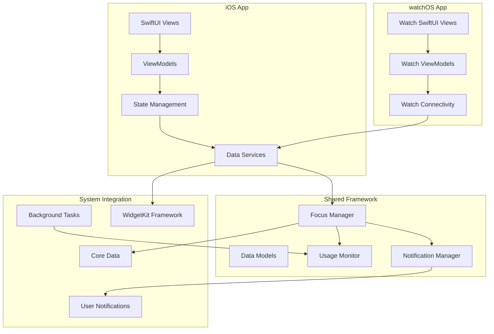
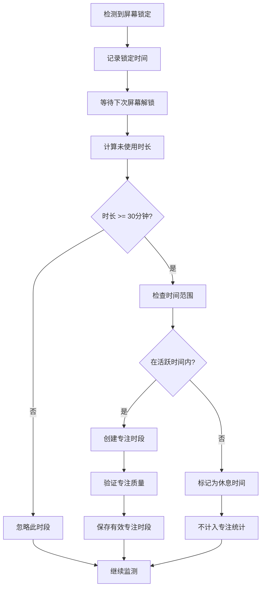

# 设计文档

## 概述

专注力追踪应用是一个原生iOS和watchOS应用，采用SwiftUI框架构建。应用通过监测用户的设备使用模式来识别专注时段，并提供美观的数据可视化、智能通知和便捷的小组件功能。

### 核心设计原则
- **隐私优先**：所有数据本地存储，不上传到服务器
- **低功耗**：优化电池使用，采用高效的后台监测机制
- **用户友好**：直观的界面设计，最小化用户配置需求
- **准确性**：智能算法区分真实专注与休息时间

## 架构

### 整体架构



### 技术栈
- **UI框架**：SwiftUI (iOS 15+, watchOS 8+)
- **数据存储**：Core Data + CloudKit (可选同步)
- **状态管理**：Combine + ObservableObject
- **后台处理**：Background App Refresh + Background Tasks
- **通知**：User Notifications Framework
- **小组件**：WidgetKit
- **Watch通信**：Watch Connectivity Framework

## 组件和接口

### 1. 核心数据层

#### FocusSession (Core Data Entity)
```swift
@objc(FocusSession)
public class FocusSession: NSManagedObject {
    @NSManaged public var startTime: Date
    @NSManaged public var endTime: Date?
    @NSManaged public var duration: TimeInterval
    @NSManaged public var isValid: Bool
    @NSManaged public var sessionType: String // "focus", "break", "sleep"
}
```

#### UsageEvent (Core Data Entity)
```swift
@objc(UsageEvent)
public class UsageEvent: NSManagedObject {
    @NSManaged public var timestamp: Date
    @NSManaged public var eventType: String // "screen_on", "screen_off", "app_switch"
    @NSManaged public var appIdentifier: String?
    @NSManaged public var duration: TimeInterval
}
```

#### UserSettings (Core Data Entity)
```swift
@objc(UserSettings)
public class UserSettings: NSManagedObject {
    @NSManaged public var dailyFocusGoal: TimeInterval
    @NSManaged public var sleepStartTime: Date
    @NSManaged public var sleepEndTime: Date
    @NSManaged public var lunchBreakEnabled: Bool
    @NSManaged public var lunchBreakStart: Date
    @NSManaged public var lunchBreakEnd: Date
    @NSManaged public var notificationsEnabled: Bool
}
```

### 2. 业务逻辑层

#### FocusManager
```swift
protocol FocusManagerProtocol {
    func startMonitoring()
    func stopMonitoring()
    func getCurrentFocusSession() -> FocusSession?
    func getFocusStatistics(for date: Date) -> FocusStatistics
    func getWeeklyTrend() -> [DailyFocusData]
}

class FocusManager: ObservableObject, FocusManagerProtocol {
    @Published var currentSession: FocusSession?
    @Published var todaysFocusTime: TimeInterval = 0
    @Published var isInFocusMode: Bool = false
    
    private let usageMonitor: UsageMonitorProtocol
    private let dataService: DataServiceProtocol
    private let settingsManager: SettingsManagerProtocol
}
```

#### UsageMonitor
```swift
protocol UsageMonitorProtocol {
    func startMonitoring()
    func stopMonitoring()
    var onUsageEvent: ((UsageEvent) -> Void)? { get set }
}

class UsageMonitor: UsageMonitorProtocol {
    private var screenTimeObserver: NSObjectProtocol?
    private var appStateObserver: NSObjectProtocol?
    
    func detectFocusSession(from events: [UsageEvent]) -> FocusSession?
    func isWithinActiveHours(_ date: Date) -> Bool
    func shouldExcludeAsRestTime(_ session: FocusSession) -> Bool
}
```

### 3. 用户界面层

#### 主要视图结构
```
TabView
├── HomeView (今日专注概览)
│   ├── FocusRingView (圆环进度)
│   ├── CurrentSessionView (当前专注状态)
│   └── QuickStatsView (快速统计)
├── StatisticsView (详细统计)
│   ├── WeeklyTrendChart (周趋势图)
│   ├── FocusSessionsList (专注时段列表)
│   └── PersonalRecordsView (个人记录)
├── SettingsView (设置)
│   ├── GoalSettingView (目标设置)
│   ├── TimeRangeSettingView (时间范围设置)
│   └── NotificationSettingView (通知设置)
```

#### Watch应用视图结构
```
NavigationView
├── WatchHomeView (专注状态概览)
├── WatchStatsView (简化统计)
└── WatchControlsView (快速操作)
```

### 4. 小组件设计

#### 小组件类型
- **小尺寸**：今日专注时间 + 目标进度环
- **中尺寸**：专注时间 + 最长专注记录 + 周趋势迷你图
- **大尺寸**：完整的今日统计 + 7天趋势图

#### Widget配置
```swift
struct FocusWidget: Widget {
    let kind: String = "FocusWidget"
    
    var body: some WidgetConfiguration {
        StaticConfiguration(kind: kind, provider: FocusTimelineProvider()) { entry in
            FocusWidgetEntryView(entry: entry)
        }
        .configurationDisplayName("专注追踪")
        .description("查看你的专注时间和进度")
        .supportedFamilies([.systemSmall, .systemMedium, .systemLarge])
    }
}
```

## 数据模型

### 专注时段识别算法



### 数据流设计

1. **数据收集**：后台监测屏幕状态和应用使用
2. **数据处理**：实时分析识别专注时段
3. **数据存储**：Core Data本地存储，可选iCloud同步
4. **数据展示**：SwiftUI视图响应式更新
5. **数据同步**：iOS与watchOS通过Watch Connectivity同步

## 错误处理

### 错误类型定义
```swift
enum FocusTrackingError: LocalizedError {
    case permissionDenied
    case dataCorruption
    case backgroundTaskFailed
    case watchConnectivityError
    case notificationPermissionDenied
    
    var errorDescription: String? {
        switch self {
        case .permissionDenied:
            return "需要屏幕时间权限来追踪专注时间"
        case .dataCorruption:
            return "数据损坏，正在尝试恢复"
        case .backgroundTaskFailed:
            return "后台任务失败，可能影响专注追踪准确性"
        case .watchConnectivityError:
            return "与Apple Watch连接失败"
        case .notificationPermissionDenied:
            return "需要通知权限来发送专注提醒"
        }
    }
}
```

### 错误处理策略
- **权限错误**：友好的引导用户授权界面
- **数据错误**：自动备份恢复机制
- **网络错误**：优雅降级，本地功能不受影响
- **系统错误**：错误日志记录，用户友好的错误提示

## 测试策略

### 单元测试
- **FocusManager**：专注时段识别逻辑
- **UsageMonitor**：使用事件检测准确性
- **DataService**：数据存储和检索功能
- **SettingsManager**：用户设置管理

### 集成测试
- **iOS-watchOS同步**：数据一致性验证
- **后台任务**：长时间运行稳定性
- **小组件更新**：数据刷新及时性
- **通知系统**：推送通知准确性

### UI测试
- **主要用户流程**：从设置到查看统计的完整流程
- **边界情况**：极端数据情况下的界面表现
- **可访问性**：VoiceOver和其他辅助功能支持

### 性能测试
- **电池使用**：后台监测对电池的影响
- **内存使用**：长期运行的内存稳定性
- **数据库性能**：大量历史数据的查询效率

## 隐私和安全

### 数据隐私
- **本地存储**：所有敏感数据仅存储在用户设备上
- **最小化收集**：只收集专注追踪必需的数据
- **用户控制**：用户可随时删除所有数据
- **透明度**：清晰说明数据使用方式

### 安全措施
- **数据加密**：Core Data启用加密存储
- **权限最小化**：只请求必要的系统权限
- **代码混淆**：发布版本进行代码保护
- **安全审计**：定期进行安全漏洞检查