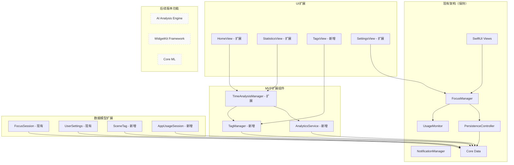
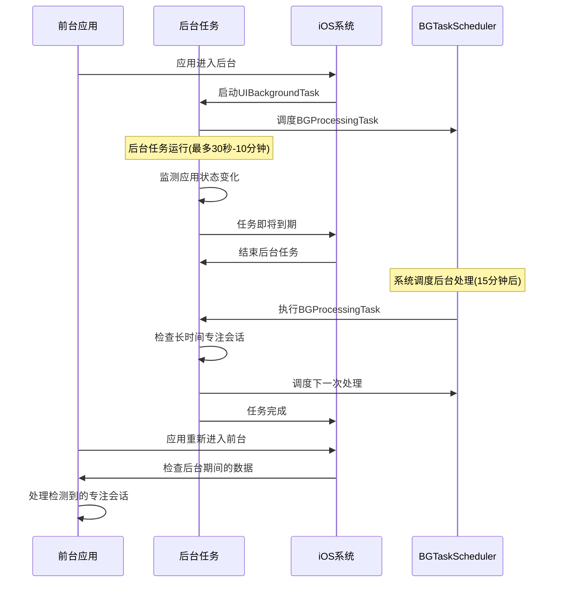
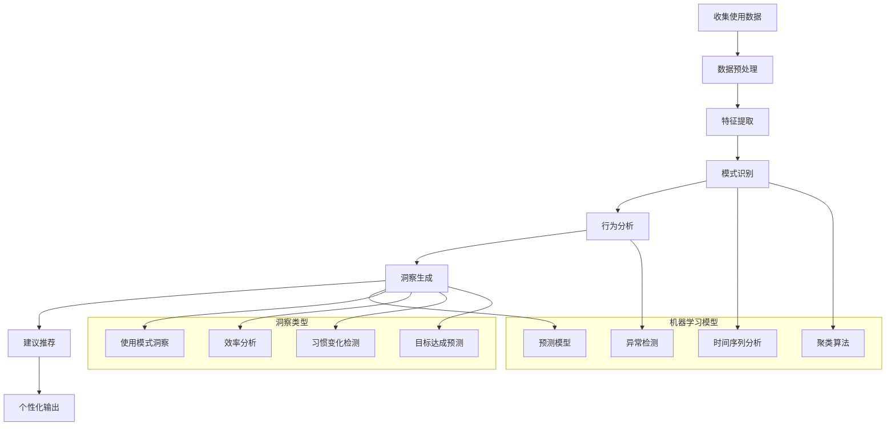
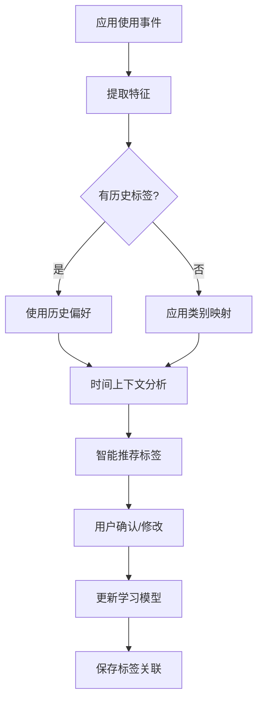

# 设计文档

## 概述

智能时间分析应用基于现有的FocusTracker项目进行扩展开发，采用SwiftUI框架构建。MVP版本将在现有专注追踪功能基础上，扩展为全面的时间监控和基础分析功能。

### 现有项目基础
- **架构**：已建立MVVM架构，包含FocusManager、UsageMonitor、NotificationManager
- **数据层**：Core Data持久化，包含FocusSession和UserSettings实体
- **UI层**：SwiftUI界面，包含HomeView、StatisticsView、SettingsView
- **服务层**：后台监控、通知管理、数据持久化服务

### MVP扩展设计原则
- **增量开发**：基于现有代码进行功能扩展，避免重写
- **向后兼容**：保持现有专注追踪功能的完整性
- **架构复用**：利用现有的服务层和数据层架构
- **渐进增强**：逐步添加新功能，确保每个阶段都可用

### MVP扩展功能范围
- **监控扩展**：从专注追踪扩展到全面应用使用监控
- **场景标签**：在现有数据模型基础上添加标签分类
- **分析增强**：扩展现有统计功能，添加更丰富的可视化
- **界面优化**：改进现有界面以支持新的分析功能

## 架构

### 基于现有项目的扩展架构



### MVP技术栈
- **UI框架**：SwiftUI (iOS 16+)
- **数据存储**：Core Data（本地存储）
- **状态管理**：Combine + ObservableObject
- **使用监控**：DeviceActivity Framework
- **图表可视化**：Swift Charts
- **后台处理**：Background App Refresh + BGTaskScheduler

### 后续版本技术栈
- **AI分析**：Core ML + Create ML + Natural Language
- **云同步**：CloudKit
- **通知**：User Notifications Framework
- **小组件**：WidgetKit
- **数据分析**：Accelerate Framework

## 组件和接口

### 1. 核心数据层

#### AppUsageSession (Core Data Entity)
```swift
@objc(AppUsageSession)
public class AppUsageSession: NSManagedObject {
    @NSManaged public var startTime: Date
    @NSManaged public var endTime: Date
    @NSManaged public var duration: TimeInterval
    @NSManaged public var appIdentifier: String
    @NSManaged public var appName: String
    @NSManaged public var categoryIdentifier: String
    @NSManaged public var sceneTag: String?
    @NSManaged public var isProductiveTime: Bool
    @NSManaged public var interruptionCount: Int16
}
```

#### SceneTag (Core Data Entity)
```swift
@objc(SceneTag)
public class SceneTag: NSManagedObject {
    @NSManaged public var tagID: String
    @NSManaged public var name: String
    @NSManaged public var color: String
    @NSManaged public var isDefault: Bool
    @NSManaged public var createdAt: Date
    @NSManaged public var usageCount: Int32
    @NSManaged public var associatedApps: Set<String>
}
```

#### AIInsight (Core Data Entity)
```swift
@objc(AIInsight)
public class AIInsight: NSManagedObject {
    @NSManaged public var insightID: String
    @NSManaged public var type: String // "pattern", "recommendation", "achievement", "warning"
    @NSManaged public var title: String
    @NSManaged public var content: String
    @NSManaged public var confidence: Float
    @NSManaged public var createdAt: Date
    @NSManaged public var isRead: Bool
    @NSManaged public var actionable: Bool
    @NSManaged public var relatedData: Data? // JSON encoded related metrics
}
```

#### UserBehaviorPattern (Core Data Entity)
```swift
@objc(UserBehaviorPattern)
public class UserBehaviorPattern: NSManagedObject {
    @NSManaged public var patternID: String
    @NSManaged public var patternType: String // "daily_peak", "app_sequence", "break_pattern"
    @NSManaged public var description: String
    @NSManaged public var strength: Float // 0.0 to 1.0
    @NSManaged public var detectedAt: Date
    @NSManaged public var lastUpdated: Date
    @NSManaged public var isActive: Bool
    @NSManaged public var metadata: Data? // JSON encoded pattern details
}
```

#### UserSettings (Core Data Entity)
```swift
@objc(UserSettings)
public class UserSettings: NSManagedObject {
    @NSManaged public var dailyFocusGoal: TimeInterval
    @NSManaged public var sleepStartTime: Date
    @NSManaged public var sleepEndTime: Date
    @NSManaged public var lunchBreakEnabled: Bool
    @NSManaged public var lunchBreakStart: Date
    @NSManaged public var lunchBreakEnd: Date
    @NSManaged public var notificationsEnabled: Bool
    @NSManaged public var aiAnalysisEnabled: Bool
    @NSManaged public var autoTaggingEnabled: Bool
    @NSManaged public var weeklyReportEnabled: Bool
}
```

### 2. 业务逻辑层

#### TimeAnalysisManager
```swift
protocol TimeAnalysisManagerProtocol {
    func startMonitoring()
    func stopMonitoring()
    func getUsageStatistics(for date: Date) -> UsageStatistics
    func getWeeklyTrend() -> [DailyUsageData]
    func getAppUsageBreakdown(for date: Date) -> [AppUsageData]
    func getSceneTagDistribution(for date: Date) -> [SceneTagData]
}

class TimeAnalysisManager: ObservableObject, TimeAnalysisManagerProtocol {
    @Published var todaysUsageTime: TimeInterval = 0
    @Published var todaysAppBreakdown: [AppUsageData] = []
    @Published var currentActiveApp: String?
    @Published var isMonitoring: Bool = false
    
    private let usageMonitor: UsageMonitorProtocol
    private let aiAnalysisEngine: AIAnalysisEngineProtocol
    private let tagManager: TagManagerProtocol
    private let dataService: DataServiceProtocol
}
```

#### AIAnalysisEngine
```swift
protocol AIAnalysisEngineProtocol {
    func analyzeUsagePatterns(for period: DateInterval) async -> [UserBehaviorPattern]
    func generateInsights(from patterns: [UserBehaviorPattern]) async -> [AIInsight]
    func predictOptimalSchedule(based on: [AppUsageSession]) async -> OptimalSchedule
    func detectAnomalies(in sessions: [AppUsageSession]) async -> [UsageAnomaly]
    func recommendTimeGoals(based on: [AppUsageSession]) async -> [TimeGoalRecommendation]
}

class AIAnalysisEngine: AIAnalysisEngineProtocol {
    private let mlModel: MLModel
    private let patternRecognizer: PatternRecognizer
    private let insightGenerator: InsightGenerator
    
    func analyzeUsagePatterns(for period: DateInterval) async -> [UserBehaviorPattern] {
        // 使用Core ML分析用户行为模式
        // 识别高峰使用时段、应用切换模式、专注时长等
    }
    
    func generateInsights(from patterns: [UserBehaviorPattern]) async -> [AIInsight] {
        // 基于识别的模式生成个性化洞察
        // 提供改善建议和行动方案
    }
}
```

#### TagManager
```swift
protocol TagManagerProtocol {
    func getDefaultTags() -> [SceneTag]
    func createCustomTag(name: String, color: String) -> SceneTag
    func suggestTagForApp(_ appIdentifier: String) -> SceneTag?
    func updateTagForSession(_ session: AppUsageSession, tag: SceneTag)
    func getTagDistribution(for date: Date) -> [TagDistribution]
    func getTagTrends(for period: DateInterval) -> [TagTrend]
}

class TagManager: ObservableObject, TagManagerProtocol {
    @Published var availableTags: [SceneTag] = []
    @Published var customTags: [SceneTag] = []
    
    private let appCategoryMapping: [String: String] = [
        "com.apple.mobilemail": "工作",
        "com.microsoft.Office.Word": "工作",
        "com.apple.mobilesafari": "浏览",
        "com.tencent.xin": "社交",
        // ... 更多应用映射
    ]
    
    func getDefaultTags() -> [SceneTag] {
        return [
            SceneTag(name: "工作", color: "#007AFF", isDefault: true),
            SceneTag(name: "学习", color: "#34C759", isDefault: true),
            SceneTag(name: "娱乐", color: "#FF9500", isDefault: true),
            SceneTag(name: "社交", color: "#FF2D92", isDefault: true),
            SceneTag(name: "健康", color: "#30D158", isDefault: true),
            SceneTag(name: "购物", color: "#AC39FF", isDefault: true),
            SceneTag(name: "出行", color: "#64D2FF", isDefault: true)
        ]
    }
}
```

#### UsageMonitor
```swift
protocol UsageMonitorProtocol {
    func startMonitoring()
    func stopMonitoring()
    func getCurrentUsageSession() -> AppUsageSession?
    var onAppUsageDetected: ((AppUsageSession) -> Void)? { get set }
    var onScreenStateChanged: ((Bool) -> Void)? { get set }
}

class UsageMonitor: UsageMonitorProtocol {
    @Published var isMonitoring = false
    @Published var currentSession: AppUsageSession?
    @Published var screenTimeToday: TimeInterval = 0
    
    private let deviceActivityMonitor = DeviceActivityMonitor()
    private var backgroundTaskID: UIBackgroundTaskIdentifier = .invalid
    
    func startMonitoring() {
        // 使用DeviceActivity Framework监控应用使用
        // 设置后台任务以持续监控
    }
    
    func processUsageData(_ data: DeviceActivityData) {
        // 处理系统提供的使用数据
        // 创建AppUsageSession实例
        // 触发AI分析和标签建议
    }
}
```

### 3. 用户界面层（MVP版本）

#### MVP主要视图结构
```
TabView
├── HomeView (今日时间概览)
│   ├── TimeUsageRingView (时间使用圆环)
│   ├── AppBreakdownView (应用使用分布)
│   └── SceneTagSummaryView (场景标签汇总)
├── AnalyticsView (详细分析)
│   ├── WeeklyTrendChart (周趋势图)
│   ├── AppUsageRankingView (应用使用排行)
│   └── SceneTagAnalysisView (场景分析)
├── TagsView (标签管理)
│   ├── TagOverviewView (标签概览)
│   ├── CustomTagsView (自定义标签)
│   └── TagEditingView (标签编辑)
├── SettingsView (设置)
│   ├── GoalSettingView (目标设置)
│   └── TimeRangeSettingView (时间范围设置)
```

#### 后续版本扩展
```
├── InsightsView (AI洞察) - 后续版本
│   ├── PersonalizedInsightsView (个性化洞察)
│   ├── BehaviorPatternsView (行为模式)
│   └── RecommendationsView (改善建议)
├── 小组件功能 - 后续版本
├── 智能通知 - 后续版本
└── 高级分析功能 - 后续版本
```

#### 关键UI组件设计

##### TimeUsageRingView
```swift
struct TimeUsageRingView: View {
    let totalTime: TimeInterval
    let sceneBreakdown: [SceneTagData]
    let goal: TimeInterval
    
    var body: some View {
        ZStack {
            // 多层圆环显示不同场景的时间分布
            ForEach(sceneBreakdown.indices, id: \.self) { index in
                Circle()
                    .trim(from: startAngle(for: index), to: endAngle(for: index))
                    .stroke(sceneBreakdown[index].color, lineWidth: 8)
            }
            
            VStack {
                Text(formatTime(totalTime))
                    .font(.largeTitle.bold())
                Text("今日使用时间")
                    .font(.caption)
                    .foregroundColor(.secondary)
            }
        }
    }
}
```

##### AIInsightCard
```swift
struct AIInsightCard: View {
    let insight: AIInsight
    
    var body: some View {
        VStack(alignment: .leading, spacing: 12) {
            HStack {
                Image(systemName: iconForInsightType(insight.type))
                    .foregroundColor(colorForInsightType(insight.type))
                Text(insight.title)
                    .font(.headline)
                Spacer()
                ConfidenceBadge(confidence: insight.confidence)
            }
            
            Text(insight.content)
                .font(.body)
                .foregroundColor(.secondary)
            
            if insight.actionable {
                Button("采取行动") {
                    // 处理可操作的洞察
                }
                .buttonStyle(.borderedProminent)
            }
        }
        .padding()
        .background(Color(.systemBackground))
        .cornerRadius(12)
        .shadow(radius: 2)
    }
}
```

### 4. 小组件设计

#### 小组件类型
- **小尺寸**：今日使用时间 + 主要应用图标 + 场景标签色彩环
- **中尺寸**：使用时间分布 + 前3个应用 + AI洞察摘要
- **大尺寸**：完整的今日统计 + 场景分布图 + 7天趋势 + 个性化建议

#### Widget配置
```swift
struct TimeAnalysisWidget: Widget {
    let kind: String = "TimeAnalysisWidget"
    
    var body: some WidgetConfiguration {
        StaticConfiguration(kind: kind, provider: TimeAnalysisTimelineProvider()) { entry in
            TimeAnalysisWidgetEntryView(entry: entry)
        }
        .configurationDisplayName("时间分析")
        .description("查看你的时间使用分布和AI洞察")
        .supportedFamilies([.systemSmall, .systemMedium, .systemLarge])
    }
}

struct TimeAnalysisEntry: TimelineEntry {
    let date: Date
    let totalUsageTime: TimeInterval
    let topApps: [AppUsageData]
    let sceneDistribution: [SceneTagData]
    let aiInsight: AIInsight?
    let weeklyTrend: [DailyUsageData]
}
```

## 后台任务设计

### 后台任务架构



### 后台任务类型

#### 1. 短期后台任务 (UIBackgroundTask)
- **用途**：应用进入后台时维持监测功能
- **时长**：30秒到10分钟（系统决定）
- **功能**：
  - 监听应用状态变化
  - 记录应用进入后台的时间
  - 调度长期后台处理任务

#### 2. 后台处理任务 (BGProcessingTask)
- **用途**：定期检查和处理专注数据
- **调度**：每15分钟尝试执行一次
- **功能**：
  - 检查长时间的专注会话
  - 清理过期的临时数据
  - 预处理统计数据

### 后台权限配置

#### Info.plist 配置
```xml
<key>UIBackgroundModes</key>
<array>
    <string>processing</string>
    <string>background-processing</string>
</array>
<key>BGTaskSchedulerPermittedIdentifiers</key>
<array>
    <string>com.focustracker.app.processing</string>
</array>
```

#### 权限请求策略
1. **首次启动**：引导用户开启后台应用刷新
2. **设置页面**：提供快速跳转到系统设置的选项
3. **权限检查**：定期检查权限状态并提醒用户

### 后台数据处理

#### 专注会话检测流程
```swift
// 后台检测逻辑
func handleAppBecomeActive() {
    let now = Date()
    
    if let inactiveTime = lastAppInactiveTime {
        let inactiveDuration = now.timeIntervalSince(inactiveTime)
        
        if inactiveDuration >= minimumFocusTime {
            // 检测到潜在专注会话
            onFocusSessionDetected?(inactiveTime, now)
        }
    }
    
    lastAppActiveTime = now
}
```

#### 重复会话防止
```swift
func isDuplicateSession(startTime: Date, endTime: Date) -> Bool {
    // 检查是否已存在相似时间段的会话
    let buffer: TimeInterval = 5 * 60 // 5分钟缓冲
    let existingSessions = fetchSessions(around: startTime, buffer: buffer)
    return !existingSessions.isEmpty
}
```

### 后台任务限制和对策

#### iOS系统限制
- **时间限制**：后台任务有严格的时间限制
- **频率限制**：系统根据用户使用习惯调整后台任务频率
- **电池优化**：低电量模式会限制后台任务

#### 应对策略
- **优雅降级**：后台任务失败时不影响前台功能
- **数据补偿**：前台启动时检查并补充缺失的数据
- **用户教育**：说明后台权限的重要性
- **智能调度**：根据用户使用模式优化后台任务调度

## AI分析引擎设计

### AI分析流程



### 核心AI功能

#### 1. 行为模式识别
```swift
struct BehaviorPattern {
    let type: PatternType
    let strength: Float // 0.0 - 1.0
    let timeRange: DateInterval
    let description: String
    let metadata: [String: Any]
}

enum PatternType {
    case dailyPeak(hour: Int) // 每日使用高峰
    case appSequence([String]) // 应用使用序列
    case breakPattern(interval: TimeInterval) // 休息模式
    case focusWindow(duration: TimeInterval) // 专注时段
    case weekendDifference(ratio: Float) // 工作日vs周末差异
}
```

#### 2. 智能标签推荐
```swift
class SmartTagRecommender {
    private let mlModel: MLModel
    
    func recommendTag(for app: String, at time: Date, context: UsageContext) -> SceneTag? {
        let features = extractFeatures(app: app, time: time, context: context)
        let prediction = try? mlModel.prediction(from: features)
        return mapPredictionToTag(prediction)
    }
    
    private func extractFeatures(app: String, time: Date, context: UsageContext) -> MLFeatureProvider {
        // 提取特征：时间、应用类别、使用历史、上下文等
    }
}
```

#### 3. 个性化洞察生成
```swift
class InsightGenerator {
    func generateInsights(from patterns: [BehaviorPattern], 
                         usage: [AppUsageSession]) -> [AIInsight] {
        var insights: [AIInsight] = []
        
        // 效率分析洞察
        if let efficiencyInsight = analyzeEfficiency(patterns, usage) {
            insights.append(efficiencyInsight)
        }
        
        // 习惯变化洞察
        if let habitChangeInsight = detectHabitChanges(patterns) {
            insights.append(habitChangeInsight)
        }
        
        // 优化建议洞察
        if let optimizationInsight = generateOptimizationSuggestions(usage) {
            insights.append(optimizationInsight)
        }
        
        return insights
    }
}
```

### 场景标签智能分类

#### 标签分类算法


#### 特征提取
- **时间特征**：使用时间段、工作日/周末、节假日
- **应用特征**：应用类别、使用频率、使用时长
- **行为特征**：切换频率、使用模式、中断次数
- **上下文特征**：位置信息（如果授权）、日历事件

### 数据流设计

1. **数据收集**：DeviceActivity Framework监控应用使用
2. **实时处理**：后台任务处理使用数据并提取特征
3. **AI分析**：Core ML模型分析行为模式和生成洞察
4. **标签管理**：智能推荐和用户自定义标签系统
5. **数据存储**：Core Data本地存储，保护用户隐私
6. **可视化展示**：SwiftUI + Swift Charts呈现分析结果

## 错误处理

### 错误类型定义
```swift
enum TimeAnalysisError: LocalizedError {
    case deviceActivityPermissionDenied
    case screenTimePermissionDenied
    case dataCorruption
    case backgroundTaskFailed
    case aiAnalysisError
    case mlModelLoadError
    case notificationPermissionDenied
    case tagCreationFailed
    
    var errorDescription: String? {
        switch self {
        case .deviceActivityPermissionDenied:
            return "需要设备活动权限来监控应用使用"
        case .screenTimePermissionDenied:
            return "需要屏幕时间权限来获取使用数据"
        case .dataCorruption:
            return "数据损坏，正在尝试恢复"
        case .backgroundTaskFailed:
            return "后台任务失败，可能影响数据收集准确性"
        case .aiAnalysisError:
            return "AI分析暂时不可用，请稍后重试"
        case .mlModelLoadError:
            return "机器学习模型加载失败"
        case .notificationPermissionDenied:
            return "需要通知权限来发送智能提醒"
        case .tagCreationFailed:
            return "创建自定义标签失败"
        }
    }
}
```

### 错误处理策略
- **权限错误**：分步骤引导用户授权，提供详细说明
- **AI分析错误**：优雅降级到基础统计功能
- **数据错误**：自动备份恢复机制，数据完整性检查
- **ML模型错误**：回退到规则基础的分析方法
- **系统错误**：详细错误日志，用户友好的错误提示

## 测试策略

### 单元测试
- **TimeAnalysisManager**：时间分析和统计逻辑
- **AIAnalysisEngine**：AI分析算法准确性
- **TagManager**：标签管理和推荐逻辑
- **UsageMonitor**：使用事件检测准确性
- **DataService**：数据存储和检索功能
- **InsightGenerator**：洞察生成逻辑

### 集成测试
- **DeviceActivity集成**：系统API数据获取准确性
- **Core ML集成**：机器学习模型预测准确性
- **后台任务**：长时间运行稳定性和数据一致性
- **小组件更新**：数据刷新及时性和准确性
- **通知系统**：智能通知触发和内容准确性

### AI/ML测试
- **模型准确性**：行为模式识别准确率测试
- **标签推荐**：智能标签推荐准确性验证
- **洞察质量**：AI生成洞察的相关性和有用性
- **性能基准**：ML模型推理速度和资源消耗

### UI测试
- **主要用户流程**：从设置到查看分析的完整流程
- **标签管理流程**：创建、编辑、应用标签的完整流程
- **AI洞察交互**：查看和操作AI建议的用户体验
- **边界情况**：极端数据情况下的界面表现
- **可访问性**：VoiceOver和其他辅助功能支持

### 性能测试
- **电池使用**：后台监测和AI分析对电池的影响
- **内存使用**：长期运行和大量数据处理的内存稳定性
- **数据库性能**：复杂查询和大量历史数据的处理效率
- **ML推理性能**：Core ML模型在设备上的执行效率

## 隐私和安全

### 数据隐私
- **本地处理**：所有AI分析和数据处理在设备端进行，不上传到服务器
- **最小化收集**：只收集时间分析必需的应用使用数据
- **用户控制**：用户可随时查看、修改或删除所有数据
- **透明度**：详细的隐私政策说明数据收集和使用方式
- **匿名化**：敏感数据在处理前进行匿名化处理

### AI隐私保护
- **设备端AI**：所有机器学习模型在设备本地运行
- **差分隐私**：在数据分析中应用差分隐私技术
- **模型隔离**：个人化模型不与其他用户共享
- **特征保护**：敏感特征在提取后立即加密存储

### 安全措施
- **数据加密**：Core Data启用端到端加密存储
- **权限最小化**：只请求必要的系统权限（DeviceActivity、通知）
- **代码混淆**：发布版本进行代码保护和反逆向工程
- **安全审计**：定期进行安全漏洞检查和渗透测试
- **生物识别保护**：敏感数据访问支持Face ID/Touch ID验证

### 合规性
- **GDPR合规**：支持数据可携带性和被遗忘权
- **CCPA合规**：提供数据访问和删除选项
- **儿童隐私**：符合COPPA要求，限制儿童数据收集
- **本地法规**：遵守各地区数据保护法规