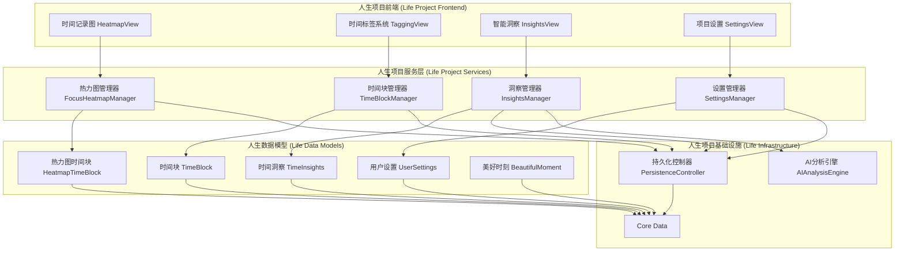
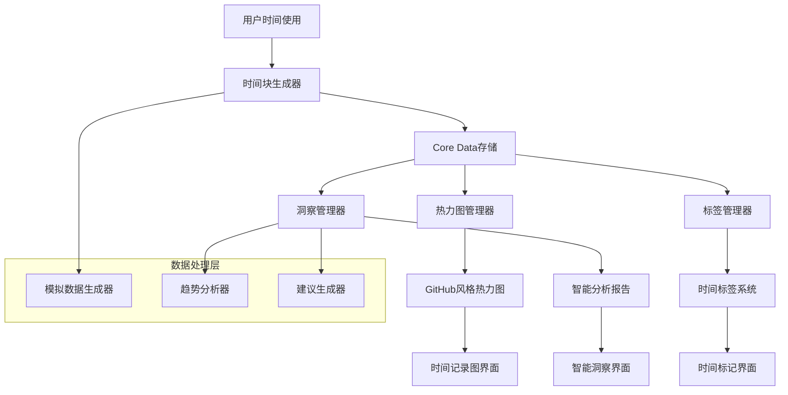

# Timelog 设计文档

## 概述

**"人生就是一个项目，你花费的时间就是在向人生的git提交记录，你还可以给你的美好时刻打上tag。"**

Timelog（时间日志）是一个充满诗意的iOS时间管理应用，将人生比作一个代码项目。我们废弃历史项目代码，基于全新的设计理念从零开始构建，让用户以程序员的视角审视和优化自己的时间使用。

### 核心设计理念
- **时间即代码**：每分钟的时间使用都是一次向人生项目的commit
- **美好时刻标记**：为重要时刻打tag，就像标记重要的代码版本
- **时间记录图**：GitHub风格的热力图展示每天的时间投入
- **智能代码审查**：AI分析时间使用模式，提供人生优化建议

### 设计原则
- **诗意化表达**：用温暖的方式重新诠释程序员熟悉的Git概念
- **情感化设计**：让用户感受到时间的温度，不只是冷冰冰的数据
- **简洁而深刻**：用简单的视觉元素传达深刻的人生哲理
- **成长可视化**：让用户看到自己的进步和变化，为"高记录"感到自豪

## 架构

### 人生项目架构设计


```mermaid
graph TB
    subgraph "人生项目前端 (Life Project Frontend)"
        HV[时间记录图 HeatmapView]
        TV[时间标签系统 TaggingView]
        IV[智能洞察 InsightsView]
        SV[项目设置 SettingsView]
    end
    
    subgraph "人生项目服务层 (Life Project Services)"
        HM[热力图管理器 FocusHeatmapManager]
        TBM[时间块管理器 TimeBlockManager]
        IM[洞察管理器 InsightsManager]
        SM[设置管理器 SettingsManager]
    end
    
    subgraph "人生数据模型 (Life Data Models)"
        TB[时间块 TimeBlock]
        HTB[热力图时间块 HeatmapTimeBlock]
        TI[时间洞察 TimeInsights]
        US[用户设置 UserSettings]
        BM[美好时刻 BeautifulMoment]
    end
    
    subgraph "人生项目基础设施 (Life Infrastructure)"
        PC[持久化控制器 PersistenceController]
        CD[Core Data]
        AI[AI分析引擎 AIAnalysisEngine]
    end
    
    HV --> HM
    TV --> TBM
    IV --> IM
    SV --> SM
    
    HM --> HTB
    TBM --> TB
    IM --> TI
    SM --> US
    
    HM --> PC
    TBM --> PC
    IM --> PC
    SM --> PC
    
    PC --> CD
    IM --> AI
    
    TB --> CD
    HTB --> CD
    TI --> CD
    US --> CD
    BM --> CD
```

### 技术栈选择

#### 核心技术栈
- **UI框架**：SwiftUI - 现代声明式UI，完美支持iOS原生设计
- **数据存储**：Core Data - 本地数据持久化，保护用户隐私
- **状态管理**：Combine + ObservableObject - 响应式编程模式
- **图表可视化**：自定义SwiftUI组件 - 打造独特的GitHub风格热力图

#### 设计系统
- **颜色系统**：GitHub记录图配色方案
  - 深绿色 (#196127): 高度专注
  - 中绿色 (#239a3b): 中等专注  
  - 浅绿色 (#7bc96f): 轻度专注
  - 灰色 (#ebedf0): 无活动
- **字体系统**：SF Pro - Apple原生字体系统
- **图标系统**：SF Symbols - 语义化图标设计

## 组件和接口

### 1. 人生数据模型层 (Life Data Models)

#### TimeBlock - 时间提交记录
```swift
@objc(TimeBlock)
public class TimeBlock: NSManagedObject {
    @NSManaged public var id: UUID
    @NSManaged public var startTime: Date        // 提交开始时间
    @NSManaged public var endTime: Date          // 提交结束时间
    @NSManaged public var duration: Double       // 提交时长
    @NSManaged public var isTagged: Bool         // 是否已标记
    @NSManaged public var taggedActivity: String? // 活动标签（commit message）
    @NSManaged public var category: String?      // 分类标签
    @NSManaged public var notes: String?         // 备注信息
    
    // 计算属性
    var timeRangeString: String {
        let formatter = DateFormatter()
        formatter.timeStyle = .short
        return "\(formatter.string(from: startTime)) - \(formatter.string(from: endTime))"
    }
    
    var formattedDuration: String {
        let hours = Int(duration) / 3600
        let minutes = Int(duration.truncatingRemainder(dividingBy: 3600)) / 60
        return hours > 0 ? "\(hours)h \(minutes)m" : "\(minutes)m"
    }
}
```

#### HeatmapTimeBlock - 热力图时间块
```swift
struct HeatmapTimeBlock {
    let id = UUID()
    let startTime: Date
    let endTime: Date
    let focusIntensity: Double      // 专注强度 (0.0 - 1.0)
    let interruptionCount: Int      // 打断次数
    let totalFocusTime: TimeInterval // 总专注时间
    let category: String?           // 分类
    let activities: [String]        // 活动列表
    
    var duration: TimeInterval {
        endTime.timeIntervalSince(startTime)
    }
    
    var focusQuality: FocusQuality {
        switch focusIntensity {
        case 0.8...1.0: return .excellent
        case 0.6..<0.8: return .good
        case 0.4..<0.6: return .fair
        case 0.2..<0.4: return .poor
        default: return .veryPoor
        }
    }
}

enum FocusQuality: String, CaseIterable {
    case excellent = "优秀"
    case good = "良好"
    case fair = "一般"
    case poor = "较差"
    case veryPoor = "很差"
    
    var color: Color {
        switch self {
        case .excellent: return .green
        case .good: return .green.opacity(0.8)
        case .fair: return .green.opacity(0.6)
        case .poor: return .orange
        case .veryPoor: return .red
        }
    }
}
```

#### BeautifulMoment - 美好时刻标记
```swift
@objc(BeautifulMoment)
public class BeautifulMoment: NSManagedObject {
    @NSManaged public var id: UUID
    @NSManaged public var timeBlock: TimeBlock
    @NSManaged public var title: String          // 美好时刻标题
    @NSManaged public var description: String    // 详细描述
    @NSManaged public var emotion: String        // 情感标记
    @NSManaged public var createdAt: Date        // 创建时间
    @NSManaged public var isSpecial: Bool        // 是否特别重要
    @NSManaged public var tags: Set<String>      // 相关标签
    
    // 美好时刻类型
    enum MomentType: String, CaseIterable {
        case achievement = "成就时刻"
        case learning = "学习收获"
        case creativity = "创意灵感"
        case connection = "人际连接"
        case peace = "内心平静"
        case joy = "快乐时光"
    }
}
```

#### UserSettings - 项目配置
```swift
@objc(UserSettings)
public class UserSettings: NSManagedObject {
    @NSManaged public var timeBlockGranularity: TimeInterval // 时间块粒度
    @NSManaged public var workingHoursStart: Date           // 工作时间开始
    @NSManaged public var workingHoursEnd: Date             // 工作时间结束
    @NSManaged public var enableBeautifulMoments: Bool      // 启用美好时刻
    @NSManaged public var autoTaggingEnabled: Bool          // 自动标记
    @NSManaged public var heatmapColorScheme: String        // 热力图配色
    @NSManaged public var dailyGoalHours: Double            // 每日目标时间
    @NSManaged public var weeklyReviewEnabled: Bool         // 周报功能
}
```

### 2. 人生项目服务层 (Life Project Services)

#### TimeBlockManager - 时间块管理器
```swift
class TimeBlockManager: ObservableObject {
    private let viewContext: NSManagedObjectContext
    @Published var blockDuration: TimeInterval = 20 * 60 // 默认20分钟粒度
    
    init(viewContext: NSManagedObjectContext) {
        self.viewContext = viewContext
    }
    
    // 获取指定日期的时间块（人生提交记录）
    func getTimeBlocks(for date: Date) -> [TimeBlock] {
        // 从Core Data获取时间块
        // 如果没有数据，生成模拟数据用于演示
    }
    
    // 为时间块添加标签（就像给commit添加message）
    func tagTimeBlock(_ timeBlock: TimeBlock, activity: String, category: String, notes: String? = nil) {
        timeBlock.taggedActivity = activity
        timeBlock.category = category
        timeBlock.notes = notes
        timeBlock.isTagged = true
        saveContext()
    }
    
    // 移除时间块标签
    func removeTag(from timeBlock: TimeBlock) {
        timeBlock.taggedActivity = nil
        timeBlock.category = nil
        timeBlock.notes = nil
        timeBlock.isTagged = false
        saveContext()
    }
    
    // 创建美好时刻标记
    func createBeautifulMoment(for timeBlock: TimeBlock, title: String, description: String) -> BeautifulMoment {
        let moment = BeautifulMoment(context: viewContext)
        moment.id = UUID()
        moment.timeBlock = timeBlock
        moment.title = title
        moment.description = description
        moment.createdAt = Date()
        moment.isSpecial = true
        saveContext()
        return moment
    }
}
```

#### FocusHeatmapManager - 时间记录图管理器
```swift
class FocusHeatmapManager: ObservableObject {
    private let viewContext: NSManagedObjectContext
    
    init(viewContext: NSManagedObjectContext) {
        self.viewContext = viewContext
    }
    
    // 生成GitHub风格的热力图数据
    func generateHeatmapBlocks(for date: Date) -> [HeatmapTimeBlock] {
        let sessions = fetchFocusSessions(for: date)
        
        if sessions.isEmpty {
            return generateMockHeatmapBlocks(for: date) // 演示数据
        }
        
        return analyzeSessionsToHeatmapBlocks(sessions, for: date)
    }
    
    // 分析专注趋势（就像分析代码提交频率）
    func analyzeFocusTrends(for timeBlocks: [HeatmapTimeBlock]) -> FocusTrendAnalysis {
        let totalBlocks = timeBlocks.count
        guard totalBlocks > 0 else {
            return FocusTrendAnalysis(
                averageIntensity: 0,
                totalFocusTime: 0,
                totalInterruptions: 0,
                qualityDistribution: [:]
            )
        }
        
        let totalIntensity = timeBlocks.reduce(0) { $0 + $1.focusIntensity }
        let averageIntensity = totalIntensity / Double(totalBlocks)
        
        let totalFocusTime = timeBlocks.reduce(0) { $0 + $1.totalFocusTime }
        let totalInterruptions = timeBlocks.reduce(0) { $0 + $1.interruptionCount }
        
        var qualityDistribution: [FocusQuality: Int] = [:]
        for block in timeBlocks {
            qualityDistribution[block.focusQuality, default: 0] += 1
        }
        
        return FocusTrendAnalysis(
            averageIntensity: averageIntensity,
            totalFocusTime: totalFocusTime,
            totalInterruptions: totalInterruptions,
            qualityDistribution: qualityDistribution
        )
    }
    
    // 生成一周的热力图数据（就像GitHub的记录图）
    func generateWeeklyHeatmap(startDate: Date) -> [Date: [HeatmapTimeBlock]] {
        var weeklyData: [Date: [HeatmapTimeBlock]] = [:]
        let calendar = Calendar.current
        
        for dayOffset in 0..<7 {
            if let date = calendar.date(byAdding: .day, value: dayOffset, to: startDate) {
                weeklyData[date] = generateHeatmapBlocks(for: date)
            }
        }
        
        return weeklyData
    }
}
```

#### InsightsManager - 智能代码审查管理器
```swift
class InsightsManager: ObservableObject {
    private let viewContext: NSManagedObjectContext
    
    init(viewContext: NSManagedObjectContext) {
        self.viewContext = viewContext
    }
    
    // 生成人生代码审查报告
    func generateInsights(for timeRange: InsightsView.TimeRange) -> TimeInsights {
        let (startDate, endDate) = getDateRange(for: timeRange)
        let timeBlocks = fetchTimeBlocks(from: startDate, to: endDate)
        
        return analyzeTimeBlocks(timeBlocks, timeRange: timeRange)
    }
    
    // 分析时间使用模式（就像分析代码质量）
    private func analyzeTimeBlocks(_ timeBlocks: [TimeBlock], timeRange: InsightsView.TimeRange) -> TimeInsights {
        if timeBlocks.isEmpty {
            return generateMockInsights(for: timeRange)
        }
        
        let totalTime = timeBlocks.reduce(0) { $0 + $1.duration }
        let taggedBlocks = timeBlocks.filter { $0.isTagged }
        let taggedPercentage = timeBlocks.isEmpty ? 0 : Double(taggedBlocks.count) / Double(timeBlocks.count)
        
        // 计算分类分布
        var categoryDistribution: [String: TimeInterval] = [:]
        for block in taggedBlocks {
            let category = block.category ?? "未分类"
            categoryDistribution[category, default: 0] += block.duration
        }
        
        // 计算平均每日时间
        let days = getDaysCount(for: timeRange)
        let averageDaily = totalTime / TimeInterval(days)
        
        // 分析最活跃时段
        let mostActiveHour = analyzeMostActiveHour(timeBlocks)
        
        // 计算平均专注度
        let averageFocusIntensity = calculateAverageFocusIntensity(timeBlocks)
        
        // 找出最常用标签
        let mostUsedTag = findMostUsedTag(taggedBlocks)
        
        // 生成改进建议（就像代码review建议）
        let recommendations = generateRecommendations(
            totalTime: totalTime,
            taggedPercentage: taggedPercentage,
            categoryDistribution: categoryDistribution
        )
        
        return TimeInsights(
            totalTime: totalTime,
            averageDaily: averageDaily,
            taggedPercentage: taggedPercentage,
            categoryDistribution: categoryDistribution,
            mostActiveHour: mostActiveHour,
            averageFocusIntensity: averageFocusIntensity,
            mostUsedTag: mostUsedTag,
            recommendations: recommendations
        )
    }
}
```

#### SettingsManager - 项目配置管理器
```swift
class SettingsManager: ObservableObject {
    private let viewContext: NSManagedObjectContext
    
    init(viewContext: NSManagedObjectContext) {
        self.viewContext = viewContext
    }
    
    // 清除所有人生数据（重置项目）
    func clearAllData() {
        let timeBlockRequest: NSFetchRequest<NSFetchRequestResult> = TimeBlock.fetchRequest()
        let timeBlockDeleteRequest = NSBatchDeleteRequest(fetchRequest: timeBlockRequest)
        
        do {
            try viewContext.execute(timeBlockDeleteRequest)
            try viewContext.save()
            print("All life project data cleared successfully")
        } catch {
            print("Failed to clear life project data: \(error)")
        }
    }
    
    // 导出人生数据（就像导出代码仓库）
    func exportData(format: DataExportView.ExportFormat, dateRange: DataExportView.DateRange) -> URL? {
        let (startDate, endDate) = getDateRange(for: dateRange)
        let timeBlocks = fetchTimeBlocks(from: startDate, to: endDate)
        
        switch format {
        case .csv:
            return exportToCSV(timeBlocks: timeBlocks)
        case .json:
            return exportToJSON(timeBlocks: timeBlocks)
        }
    }
}
```

### 3. 人生项目界面层 (Life Project UI)

#### 主要界面结构
```
ContentView (TabView)
├── TimeView (时间)
│   ├── SegmentedControl (记录图/标签切换)
│   ├── HeatmapContentView (GitHub风格热力图)
│   │   ├── TimeHeatmapView (热力图组件)
│   │   ├── DailyStatsCard (今日统计卡片)
│   │   └── DatePicker (日期选择器)
│   └── TaggingContentView (时间标签系统)
│       ├── TimeBlockRowView (时间块行视图)
│       ├── TimeBlockTaggingSheet (标记表单)
│       └── EmptyStateView (空状态视图)
├── InsightsView (洞察)
│   ├── OverviewCard (时间总览卡片)
│   ├── TimeDistributionCard (时间分布卡片)
│   ├── HabitsAnalysisCard (习惯分析卡片)
│   └── RecommendationsCard (建议卡片)
└── SettingsView (设置)
    ├── TimeBlockSettingsView (时间块设置)
    ├── TagManagementView (标签管理)
    ├── DataExportView (数据导出)
    └── AboutView (关于页面)
```

#### 核心UI组件设计

##### TimeHeatmapView - GitHub风格热力图
```swift
struct TimeHeatmapView: View {
    let date: Date
    let timeBlocks: [HeatmapTimeBlock]
    
    // GitHub贡献图配置
    private let blockSize: CGFloat = 12
    private let blockSpacing: CGFloat = 2
    private let blocksPerRow = 24 // 24小时
    
    var body: some View {
        VStack(alignment: .leading, spacing: 8) {
            // 标题
            HStack {
                Text("时间记录图")
                    .font(.headline)
                    .fontWeight(.semibold)
                
                Spacer()
                
                Text(formatDate(date))
                    .font(.caption)
                    .foregroundColor(.secondary)
            }
            
            // GitHub风格热力图网格
            LazyVGrid(columns: Array(repeating: GridItem(.fixed(blockSize), spacing: blockSpacing), count: blocksPerRow), spacing: blockSpacing) {
                ForEach(0..<24, id: \.self) { hour in
                    TimeBlockCell(
                        hour: hour,
                        timeBlock: getTimeBlockForHour(hour),
                        size: blockSize
                    )
                }
            }
            
            // 时间轴标签
            HStack {
                Text("0").font(.caption2).foregroundColor(.secondary)
                Spacer()
                Text("6").font(.caption2).foregroundColor(.secondary)
                Spacer()
                Text("12").font(.caption2).foregroundColor(.secondary)
                Spacer()
                Text("18").font(.caption2).foregroundColor(.secondary)
                Spacer()
                Text("23").font(.caption2).foregroundColor(.secondary)
            }
            .padding(.horizontal, blockSize / 2)
            
            // GitHub风格图例
            HeatmapLegend()
        }
        .padding()
        .background(Color(.systemGray6))
        .cornerRadius(12)
    }
    
    // GitHub记录图颜色系统
    private func focusIntensityColor(_ intensity: Double) -> Color {
        switch intensity {
        case 0.8...1.0:
            return Color(hex: "#196127") // GitHub深绿色
        case 0.6..<0.8:
            return Color(hex: "#239a3b") // GitHub中绿色
        case 0.4..<0.6:
            return Color(hex: "#7bc96f") // GitHub浅绿色
        case 0.2..<0.4:
            return Color(hex: "#c6e48b") // GitHub很浅绿色
        default:
            return Color(hex: "#ebedf0") // GitHub灰色
        }
    }
}
```

##### TimeBlockTaggingSheet - 时间标记表单
```swift
struct TimeBlockTaggingSheet: View {
    let timeBlock: TimeBlock
    let timeBlockManager: TimeBlockManager
    let onComplete: () -> Void
    
    @State private var activity = ""
    @State private var selectedCategory = "工作"
    @State private var notes = ""
    @State private var isBeautifulMoment = false
    
    private let categories = ["工作", "学习", "娱乐", "社交", "运动", "阅读", "其他"]
    
    var body: some View {
        NavigationView {
            Form {
                // 时间信息（就像git commit信息）
                Section("提交信息") {
                    HStack {
                        Text("开始时间")
                        Spacer()
                        Text(formatTime(timeBlock.startTime))
                            .foregroundColor(.secondary)
                    }
                    
                    HStack {
                        Text("结束时间")
                        Spacer()
                        Text(formatTime(timeBlock.endTime))
                            .foregroundColor(.secondary)
                    }
                    
                    HStack {
                        Text("时长")
                        Spacer()
                        Text(formatDuration(timeBlock.duration))
                            .foregroundColor(.secondary)
                    }
                }
                
                // 活动标记（就像commit message）
                Section("提交标记") {
                    TextField("活动名称（commit message）", text: $activity)
                        .textFieldStyle(RoundedBorderTextFieldStyle())
                    
                    Picker("分类", selection: $selectedCategory) {
                        ForEach(categories, id: \.self) { category in
                            Text(category).tag(category)
                        }
                    }
                    .pickerStyle(MenuPickerStyle())
                }
                
                // 备注信息
                Section("详细描述") {
                    TextField("添加备注（可选）", text: $notes)
                        .lineLimit(3)
                }
                
                // 美好时刻标记
                Section("特殊标记") {
                    Toggle("标记为美好时刻 ✨", isOn: $isBeautifulMoment)
                        .toggleStyle(SwitchToggleStyle(tint: .gold))
                }
                
                // 删除标记选项
                if timeBlock.isTagged {
                    Section {
                        Button("移除标记", role: .destructive) {
                            timeBlockManager.removeTag(from: timeBlock)
                            onComplete()
                        }
                    }
                }
            }
            .navigationTitle("标记时间块")
            .navigationBarTitleDisplayMode(.inline)
            .navigationBarItems(
                leading: Button("取消") { onComplete() },
                trailing: Button("保存") { saveTag() }
                    .disabled(activity.isEmpty)
                    .font(.system(size: 17, weight: .semibold))
            )
        }
        .onAppear { loadExistingData() }
    }
    
    private func saveTag() {
        timeBlockManager.tagTimeBlock(
            timeBlock,
            activity: activity,
            category: selectedCategory,
            notes: notes.isEmpty ? nil : notes
        )
        
        // 如果标记为美好时刻，创建特殊标记
        if isBeautifulMoment {
            _ = timeBlockManager.createBeautifulMoment(
                for: timeBlock,
                title: activity,
                description: notes
            )
        }
        
        onComplete()
    }
}
```

##### InsightsOverviewCard - 智能洞察卡片
```swift
struct OverviewCard: View {
    let insights: TimeInsights
    
    var body: some View {
        VStack(alignment: .leading, spacing: 16) {
            Text("人生代码质量报告")
                .font(.headline)
                .fontWeight(.semibold)
            
            HStack(spacing: 20) {
                OverviewItem(
                    title: "总提交时间",
                    value: insights.formattedTotalTime,
                    icon: "clock.fill",
                    color: .blue
                )
                
                OverviewItem(
                    title: "平均每天",
                    value: insights.formattedAverageDaily,
                    icon: "calendar",
                    color: .green
                )
                
                OverviewItem(
                    title: "标记率",
                    value: String(format: "%.0f%%", insights.taggedPercentage * 100),
                    icon: "tag.fill",
                    color: .orange
                )
            }
        }
        .padding()
        .background(Color(.systemGray6))
        .cornerRadius(16)
    }
}
```

## 数据流设计

### 人生项目数据流


```mermaid
flowchart TD
    A[用户时间使用] --> B[时间块生成器]
    B --> C[Core Data存储]
    C --> D[热力图管理器]
    C --> E[洞察管理器]
    C --> F[标签管理器]
    
    D --> G[GitHub风格热力图]
    E --> H[智能分析报告]
    F --> I[时间标签系统]
    
    G --> J[时间记录图界面]
    H --> K[智能洞察界面]
    I --> L[时间标记界面]
    
    subgraph "数据处理层"
        M[模拟数据生成器]
        N[趋势分析器]
        O[建议生成器]
    end
    
    B --> M
    E --> N
    E --> O
```

### 核心数据流程

1. **时间记录**: 自动生成时间块，记录用户的时间使用
2. **标签标记**: 用户为时间块添加有意义的标签
3. **热力图生成**: 将时间数据转换为GitHub风格的可视化
4. **智能分析**: 分析时间使用模式，生成个性化洞察
5. **美好时刻**: 特殊时刻的标记和回顾功能

### 数据隐私保护

- **本地存储**: 所有数据存储在设备本地，不上传云端
- **最小化收集**: 只收集时间管理必需的数据
- **用户控制**: 用户可随时查看、修改或删除数据
- **透明度**: 清晰说明数据的收集和使用方式

## 错误处理

### 错误类型定义
```swift
enum TimeAnalysisError: LocalizedError {
    case deviceActivityPermissionDenied
    case screenTimePermissionDenied
    case dataCorruption
    case backgroundTaskFailed
    case aiAnalysisError
    case mlModelLoadError
    case notificationPermissionDenied
    case tagCreationFailed
    
    var errorDescription: String? {
        switch self {
        case .deviceActivityPermissionDenied:
            return "需要设备活动权限来监控应用使用"
        case .screenTimePermissionDenied:
            return "需要屏幕时间权限来获取使用数据"
        case .dataCorruption:
            return "数据损坏，正在尝试恢复"
        case .backgroundTaskFailed:
            return "后台任务失败，可能影响数据收集准确性"
        case .aiAnalysisError:
            return "AI分析暂时不可用，请稍后重试"
        case .mlModelLoadError:
            return "机器学习模型加载失败"
        case .notificationPermissionDenied:
            return "需要通知权限来发送智能提醒"
        case .tagCreationFailed:
            return "创建自定义标签失败"
        }
    }
}
```

### 错误处理策略
- **权限错误**：分步骤引导用户授权，提供详细说明
- **AI分析错误**：优雅降级到基础统计功能
- **数据错误**：自动备份恢复机制，数据完整性检查
- **ML模型错误**：回退到规则基础的分析方法
- **系统错误**：详细错误日志，用户友好的错误提示

## 测试策略

### 单元测试
- **TimeAnalysisManager**：时间分析和统计逻辑
- **AIAnalysisEngine**：AI分析算法准确性
- **TagManager**：标签管理和推荐逻辑
- **UsageMonitor**：使用事件检测准确性
- **DataService**：数据存储和检索功能
- **InsightGenerator**：洞察生成逻辑

### 集成测试
- **DeviceActivity集成**：系统API数据获取准确性
- **Core ML集成**：机器学习模型预测准确性
- **后台任务**：长时间运行稳定性和数据一致性
- **小组件更新**：数据刷新及时性和准确性
- **通知系统**：智能通知触发和内容准确性

### AI/ML测试
- **模型准确性**：行为模式识别准确率测试
- **标签推荐**：智能标签推荐准确性验证
- **洞察质量**：AI生成洞察的相关性和有用性
- **性能基准**：ML模型推理速度和资源消耗

### UI测试
- **主要用户流程**：从设置到查看分析的完整流程
- **标签管理流程**：创建、编辑、应用标签的完整流程
- **AI洞察交互**：查看和操作AI建议的用户体验
- **边界情况**：极端数据情况下的界面表现
- **可访问性**：VoiceOver和其他辅助功能支持

### 性能测试
- **电池使用**：后台监测和AI分析对电池的影响
- **内存使用**：长期运行和大量数据处理的内存稳定性
- **数据库性能**：复杂查询和大量历史数据的处理效率
- **ML推理性能**：Core ML模型在设备上的执行效率

## 隐私和安全

### 数据隐私
- **本地处理**：所有AI分析和数据处理在设备端进行，不上传到服务器
- **最小化收集**：只收集时间分析必需的应用使用数据
- **用户控制**：用户可随时查看、修改或删除所有数据
- **透明度**：详细的隐私政策说明数据收集和使用方式
- **匿名化**：敏感数据在处理前进行匿名化处理

### AI隐私保护
- **设备端AI**：所有机器学习模型在设备本地运行
- **差分隐私**：在数据分析中应用差分隐私技术
- **模型隔离**：个人化模型不与其他用户共享
- **特征保护**：敏感特征在提取后立即加密存储

### 安全措施
- **数据加密**：Core Data启用端到端加密存储
- **权限最小化**：只请求必要的系统权限（DeviceActivity、通知）
- **代码混淆**：发布版本进行代码保护和反逆向工程
- **安全审计**：定期进行安全漏洞检查和渗透测试
- **生物识别保护**：敏感数据访问支持Face ID/Touch ID验证

### 合规性
- **GDPR合规**：支持数据可携带性和被遗忘权
- **CCPA合规**：提供数据访问和删除选项
- **儿童隐私**：符合COPPA要求，限制儿童数据收集
- **本地法规**：遵守各地区数据保护法规